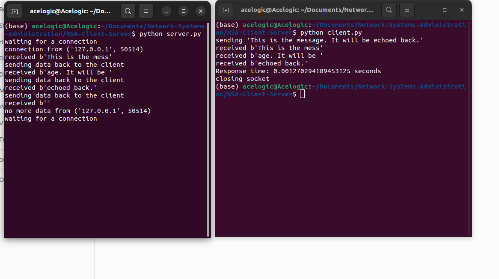
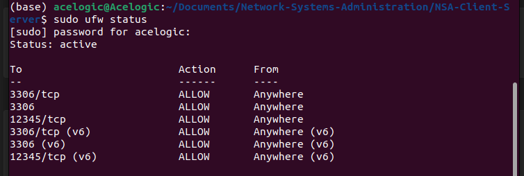

# NSA-Client-Server
A simple client-server application where the client makes a request to the server, the server processes the request, and sends back the response.

# Simple Python Client-Server Application Guide

This guide will walk you through setting up a simple client-server application in Python on an Ubuntu system. You will learn how to send requests, receive responses, trace packets, view firewall rules, and evaluate server response time.

## Contributors

- Teresiah Njeri
- Richard Karanu
- Nimrod Mutisya
- Viona Njenga
- Vanessa Kalondu

## Prerequisites
- Python 3.x installed on Ubuntu
- Basic understanding of Python programming
- Terminal access with sufficient privileges (you may need `sudo` for some commands)

## Installation and Setup

After confirming the installation of Python and `pip`, you'll need to create two Python scripts: one for the server and one for the client.

## Running the Application

To execute your scripts, open two separate terminal windows:

- In the first terminal, navigate to the location of your server script and run:

<pre>
``` python3 server.py
```
</pre>

This will start the server, which will listen for incoming connections. You will see an output as the one below


*Screenshot: Server waiting for connection*

- In the second terminal, navigate to the location of your client script and execute:

<pre>
``` python3 client.py
```
</pre>

This action will send a request to the server, which the server will process and respond to.


*Screenshot: Client and server interaction*

 

## Packet Tracing

To observe the packet flow between the client and server, you can use `tcpdump`. Run the following command in a separate terminal before starting your server and client: 


<pre>

```  sudo tcpdump -i lo -n port 12345
```
</pre>


This will display the packets that are being sent and received on the loopback interface on port 12345. You should see the output such as the one below 


*Screenshot: Packet Tracing infomation*


From the above output we can obtain the information below 
- **`22:37:09.322382`**: Timestamp when the packet was captured.

- **`IP 127.0.0.1.33240 > 127.0.0.1.12345`**: Source and destination IP addresses and ports. Communication is on the local machine (`127.0.0.1`) via the loopback interface (`lo`). Source port is `33240`, destination port is `12345`.

- **`Flags [S]`**: TCP SYN packet, the initial packet for connection setup.

- **`seq 2493292808`**: Sequence number of the packet.

- **`ack 2493292809`**: Acknowledgment number.

- **`win 65495`**: TCP window size.

- **`options [mss 65495,sackOK,TS val 1421887208 ecr 0,nop,wscale 7]`**: TCP options like Maximum Segment Size (MSS), Selective Acknowledgment (SACK), and Timestamps (TS).

- **`length 0`**: Length of the packet payload.

The lines represent different stages of TCP communication (SYN, SYN-ACK, ACK, data transmission, FIN, etc.). It shows the setup and termination of a TCP connection between the source and destination ports.

## Firewall Rule Configuration

Ubuntu system uses `ufw` (Uncomplicated Firewall) to manage network traffic rules. To allow traffic on the port that the server listens to:

- To set the rule:

<pre>
```sudo ufw allow 12345/tcp

```
</pre>


- To enable the firewall, if it's not already active:

<pre>
``` sudo ufw enable

```
</pre>


- To check the status of your firewall rules:

<pre>
``` sudo ufw status

```
</pre>
You will see output similar to the one below



*Screenshot: Server permissions and Configurations*


## Measuring Server Response Time

The server response time is the duration from when the client sends a request until it receives a response. The client script should be modified to measure and output this time, providing insights into the performance of the server.


By following this guide-All the steps , you have implmented a simple client/server application with Python on Ubuntu.

